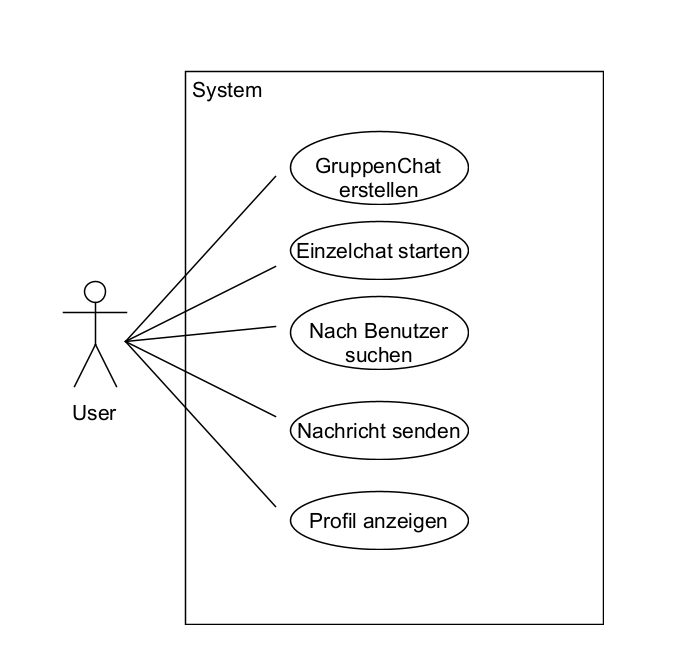
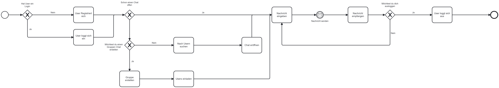

## Hier ist meine Dokumentation

## Use Case Diagramm

## Use Case Beschreibung

**1. Gruppenchat erstellen:**
Akteure: Benutzer Beschreibung: Der Benutzer wählt die Option, einen Gruppenchat zu erstellen. Das System zeigt ein Formular zum Erstellen des Gruppenchats an, in dem der
Benutzer den Namen der Gruppe und die Teilnehmer hinzufügen kann. Nach dem Ausfüllen und Bestätigen des Formulars wird der Gruppenchat erstellt.  
**2. Einzelchat starten:**
Akteure: Benutzer, Kontaktliste Beschreibung: Der Benutzer wählt die Option, einen Einzelchat zu starten. Das System zeigt die Kontaktliste an, aus der der Benutzer einen
Kontakt auswählt. Nach der Auswahl wird ein Chatfenster geöffnet, um einen Einzelchat mit dem ausgewählten Kontakt zu beginnen.  
**3. Nach Benutzern suchen:**
Akteure: Benutzer Beschreibung: Der Benutzer wählt die Option, nach anderen Benutzern zu suchen. Das System zeigt ein Suchformular an, in dem der Benutzer Suchkriterien wie
Benutzernamen oder Interessen eingeben kann. Nach der Eingabe führt das System die Suche durch und zeigt die Ergebnisse an.  
**4. Nachricht senden:**
Akteure: Benutzer, Chatfenster Beschreibung: Der Benutzer wählt die Option, eine Nachricht zu senden. Das System öffnet das Chatfenster, in dem der Benutzer die Nachricht eingeben
kann. Nach dem Senden wird die Nachricht an den ausgewählten Chat oder Kontakt gesendet.  
**5. Profil anzeigen:** 
Akteure: Benutzer Beschreibung: Der Benutzer wählt die Option, ein Benutzerprofil anzuzeigen. Das System zeigt das Profil des ausgewählten Benutzers an, das Informationen wie
Benutzername, Interessen und zuletzt aktive Zeiten enthalten kann. Der Benutzer kann das Profil lesen, um mehr über den anderen Benutzer zu erfahren.

## User Storys
**Story 1:** Als Nutzerin wünsche ich mir die Möglichkeit, Einzelchats zu eröffnen, um private Gespräche mit bestimmten Personen zu führen. Die Nachrichten sollen sicher und zuverlässig übermittelt
werden.

**Story 2:** Als Schülerin möchte ich Gruppenchats erstellen können, um mich einfach mit meinen Mitschülern abstimmen und koordinieren zu können, besonders bei Gruppenprojekten.

**Story 3:** Als Bücherliebhaberin strebe ich danach, Buchempfehlungen in Einzelchats zu senden und darüber zu diskutieren, um meine Leseerfahrungen mit anderen zu teilen.

**Story 4:** Als Fan von Rubik's Cube-Wettbewerben wünsche ich mir die Option, in Gruppenchats Nachrichten und Timer-Updates zu teilen, um Freunde zu Wettbewerben herauszufordern und Ergebnisse zu
vergleichen.

**Story 5:** Als aktive Person, die gerne ausgeht, möchte ich in Einzelchats meinen Standort teilen können, um Treffpunkte mit Freunden zu vereinbaren oder sie über interessante Veranstaltungen in der
Nähe zu informieren.

## BPMN Diagramm
Als Teil der Dokumentation habe ich den Auftrag erhalten zu der Chat App ein BPMN Diagramm zu machen.
